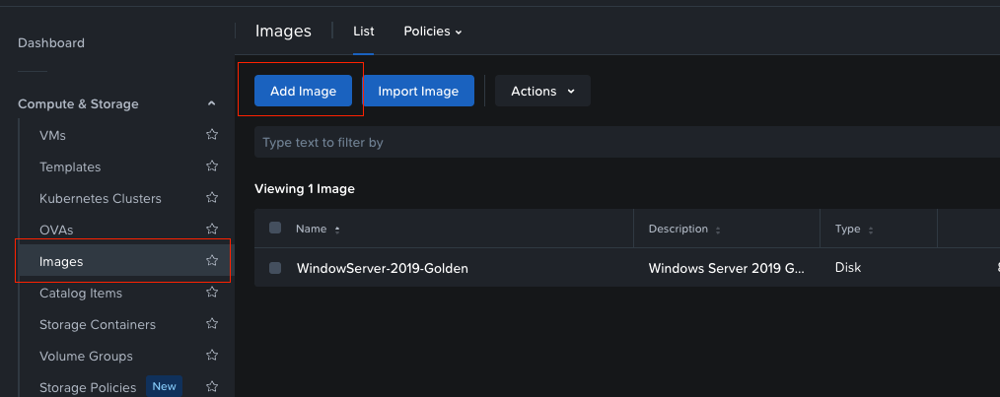
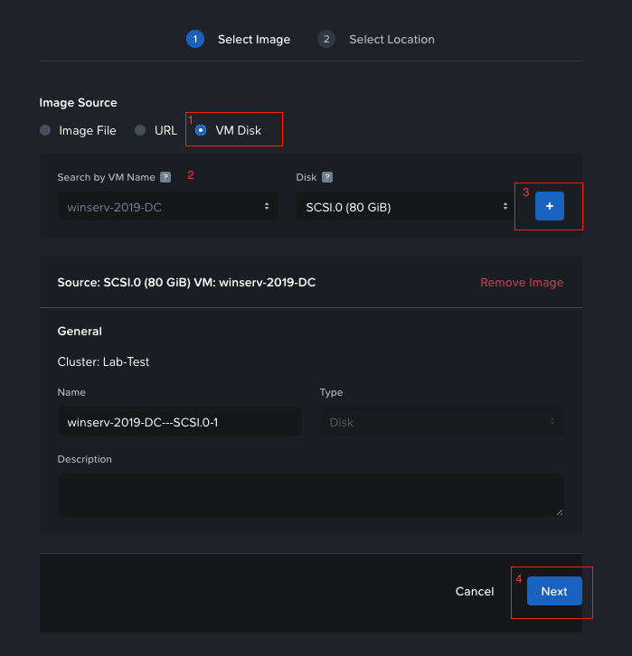

# Configuration Guide: Nutanix Ansible IaC
#### Deploying ADDC on Windows Server 2019 v1

### Overview
This guide provides the exact instructions, code and steps needed to deploy a `Windows Server 2019` Domain Controller on `Nutanix Community Edition 2.1`. Please note that some of the varibles have been hard-coded into the code-base and will require refactoring in a production environment. The ansible node is running on **Ubuntu 22.04** so please adjust commands based on HostOS.

#### Quick Start
```bash
git clone <repo_name>

# Change Variables to Point to Prism Central IP and all the var/*.yaml playbooks for custom settings
# Run Commands located in Phase I: Establish Ansible Environment for Nutanix

ansible-playbook 01_ntnx_vm_provision.yaml 
# Wait 8-10min

ansible-playbook 02-static_drive_ms-win-drive_initialize.yaml
ansible-playbook 03-ms-domain-provision.yaml
```

Important Links:
- [Nutanix Ansible Galaxy Collection](https://galaxy.ansible.com/ui/repo/published/nutanix/ncp/)
- [Windows Community Modules Full List](https://galaxy.ansible.com/ui/repo/published/community/windows/docs/?extIdCarryOver=true&sc_cid=701f2000001OH6uAAG)
- [AD Domain New Forest Module](https://docs.ansible.com/ansible/latest/collections/microsoft/ad/domain_module.html)
- [AD Existing Domain Join Module](https://docs.ansible.com/ansible/latest/collections/microsoft/ad/membership_module.html)

### Future Improvements
1. Playbook best practices should be able to pass in a variable to identify the type of server that will be deployed and pass in the correct playbook and required variables 
    ```python 
    type=domain_controller if (type==domain_controller) else execute playbook_domaincontroller.yaml
    ```
2. Future Playbooks for DomainControllers should be able to add to an existing forest not create a brand new one
3. Static IP addresses are not dynamically assigned or variable assigned in `answerfile` and has hard-coded values. Should be abstracted out with an adjoining vars file and loaded during runtime to pass in variables.
4. Also best practices like blocks and rescue commands have not been added in and should be improved on for fault toleranance for failed task execution
5. All playbooks that use the `Nutanix Cloud Platform Selection` should have the `validate_certs` set to **TRUE** 
6. The `hosts` file currently has senstive credentials hard-coded into it for ansible connecting as the Administrator user to perform additonal functions
7. The `dc-main.yaml` file has sensitive credentials hard-coded into it for logging in after the Server is domain joined. 
8. **GOAL:** Possibly bake the WinRM into the image so we can skip the xml functionality for guest_configurations and open the required port 
9. Turn off WinRM basic authentication in Answer File


### Airgapped Requirements

**List of Modules:**
- **Nutanix:**
  - nutanix.ncp.ntnx_vms
- **Community.Windows:**
  - community.windows.win_disk_facts
  - community.windows.win_initialize_disk
  - community.windows.win_partition
  - community.windows.win_format
- **Ansible.Windows:**
  - ansible.windows.win_powershell
  - ansible.windows.win_feature
- **Micorosft.AD:**
  - microsoft.ad.domain
  - microsoft.ad.membership

**Offline Download Commands**
```bash
# Pull Collections as Tars
ansible-galaxy collection download nutanix.ncp
ansible-galaxy collection download community.windows
ansible-galaxy collection download ansible.windows
ansible-galaxy collection download microsoft.ad

# Install Collections Offline
ansible-galaxy collection install <INSERT PATH>
```


## Phase I: Establish Ansible Environment for Nutanix


```bash
# Install Ansible
sudo apt update
sudo apt install software-properties-common
sudo add-apt-repository --yes --update ppa:ansible/ansible
sudo apt install ansible

# Install the Ansible Collection for v3 Nutanix API's https://www.nutanix.dev/api-reference-v3/
ansible-galaxy collection build
ansible-galaxy collection install nutanix.ncp

# Create Ansible Vault Password File
echo 'ADD_YOUR_PASSWORD' > .vault_pass

# Begin Ansible Configuration
touch hosts
# Add Content Below
[dev]
localhost ansible_connection=local

# Create config file
touch ansible.cfg
# Add Content Below
[defaults]
inventory = ./hosts
vault_password_file = ./.vault_pass

# Create Directory Structure
mkdir -p ./group_vars/dev

# Create Public Variables
touch group_vars/dev/vars
# Add Content below, dont add PORT NUMBER
---
# Public Data
pc_ip: PRISM_CENTRAL_IP

# Enrypt sensitive info using Ansible Vault
ansible-vault create group_vars/dev
# Add content below
---
# sensitive data
vault_pc_username: ADD HERE
vault_pc_password: ADD HERE
```

**Test using the below playbook**

```bash
touch clusters-info.yml
ansible-playbook clusters-info.yml
```

```yaml
---
- name: Clusters_Info playbook
  hosts: localhost
  gather_facts: false
  collections:
    - nutanix.ncp
  module_defaults:
    group/nutanix.ncp.ntnx:
      nutanix_host: "{{ pc_ip }}"
      nutanix_username: "{{ vault_pc_username }}"
      nutanix_password: "{{ vault_pc_password }}"
      validate_certs: false

  tasks:
  - name: test getting all clusters
    ntnx_clusters_info:
    register: clusters

  - name: test getting particular cluster using uuid
    ntnx_clusters_info:
      cluster_uuid: '{{ clusters.response.entities[0].metadata.uuid }}'
    register: result

  - name: List clusters using length, offset, sort order and priority sort attribute
    ntnx_clusters_info:
      length: 2
      offset: 0
      sort_order: "ASCENDING"
      sort_attribute: "name"
    register: result

  - name: Print cluster list
    ansible.builtin.debug:
      var: result
    when: result is defined
```

## Phase II: Prepping Windows Server 2019

#### Pre-reqs
- Windows Image Manager: needed to create the answer file using the `install.wim` file included in the iso file located in `/sources/install.wim`
- Pre-installed Windows Server 2019 VM: this will need to have Nutanix Guest Tools installed and a UserName/Password uploaded into the images **NOT TEMPLATES**

### 1.1: Windows Image Manager Settings

#### Overview: 
There are (3) Different `passes` that are happening in the xml file related to different overall stages/actions during the Windows Setup.
  - **Specialize:** this is for computer specific information configurations. not that custom in our code-base
  - **Generalize:** removes system information, we really just need the `Nutanix Guest Tools` which is baked into the image
  - **oobeSystem:** the bulk of the work for `first-boot` functionality 

#### Specialize
  ```bash
  Sets system locale, input language, and UI language to English (US)
  Configures computer name as "ds-001-xy"
  Sets time zone to "Eastern Standard Time"
  Disables Server Manager from opening at logon
  Disables IE Enhanced Security Configuration for admins
  Configures Remote Desktop settings
  # Not sure if this is working
  Sets up domain join information (joining "abc.com")
  ```

#### OOBE System Pass
  ```bash
  Configures auto-logon for the Administrator account
  Sets up FirstLogonCommands

  # ***First Logon Commands****

  # Create WinRM Cert and Enable Powershell Commands to run Remotely
  New-SelfSignedCertificate -CertstoreLocation Cert:\LocalMachine\My -DnsName "WinRMCertificate"
  Enable-PSRemoting -SkipNetworkProfileCheck -Force 
  # Set WinRM Firewall Rule
  New-NetFirewallRule -DisplayName 'Windows Remote Management (HTTPS-In)' -Name 'Windows Remote Management (HTTPS-In)' -Profile Any -LocalPort 5986 -Protocol TCP 
  # Per Documentation, needs to adjust to a Secure Auth in Future
  Set-Item WSMan:\localhost\Service\Auth\Basic -Value $true

  # Network Configurations
  Set Static IP Address
  Configure DNS Servers
  Set Network Profile to Private # Means network is more trust worthy and network discovery works. Also prevents certain errors I noticed
  Attempts to Join to abc.com domain # Fail
  ```


### 1.2: Golden Image
**Overview:** This process is a `requirement` as the ansible-playbook modules do not accept templates. Nutanix VM module requires the image to be stored in the `IMAGES` location.

**STEP 1: Ensure the base image has been configured with a User/Pass and Nutanix Guest Tools**

**STEP 2: Add Image in Nutanix Prism Central**



*Figure 1: Navigate to Images Panel*



*Figure 2: Add Image from Baseline VM*


## Phase III: Provision Windows Server 2019

**Goal:** Provision a VM on a Nutanix Cluster with the required disks needed for a future Domain Controller. This also passes in the image name which has the `Golden Image` of Windows Server 2019 Installed.

**Start Here:** `ansible-playbook 01_ntnx_vm_provision.yaml`

1. **Playbook Breakdown**

  ```bash
  # Temporary Facts Setting
  ```
  - Assigned temporary variables ie `facts` used later below; mainly used for adding `2 more disks` for Logs and Data for `Domain Controller`. But could be removed due to the nature of the `.ntnx_vms` module as the creation is fully controlled by that module
  - Sets the server_role as `domain_controller` but not used currently in playbook as this is a future addition

1. **VM Provisioning**

  ```yaml
  # Provisioning
  ```
  - We are passing in the `golden_image` as the boot disk image
  - But we are using the [VM_CRUD_STATES](https://galaxy.ansible.com/ui/repo/published/nutanix/ncp/content/module/ntnx_vms/) module which has numerous CRUD operations. Passing in the disks with a size and storage location allows us to create the required disks
  - The more important part of this specific playbook is passing in the `guest_customization` for all the automated commands needed as mentioned in **Section 1.1**

1. **Hosts File Modification**

  ```text
  [dev]
  localhost ansible_connection=local

  [windows]
  win-srv-2019-dc ansible_host=192.XXX.X.X

  [windows:vars]
  ansible_user=Server_Administrator_Name
  ansible_password=Server_Admin_Password
  ansible_connection=winrm
  ansible_winrm_transport=ntlm
  ansible_winrm_server_cert_validation=ignore
  ansible_port=5985
  ```
  - Now that the VM is provisioned, its up to ansible to now connect to it using `winrm` which requires updates to the `hosts` file. 
  - Currently the file keeps the sensitive information in plaintext due to testing, but should be ansible-vault encrypted in the future iterations
  - The answer file should have taken care of ensuring that the ports and winrm service is installed properly

## Phase IV: Configuring Static Drives

**Start Here:** `ansible-playbook 02_static_drive_ms-win-drive_initialize.yaml`

1. **Identifiation of Unused RAW Disks**
  ```yaml
  # Set Default Allocation Size
  - name: Set default allocation_unit_size if not defined
  ansible.builtin.set_fact:
    allocation_unit_size: 0
  when: allocation_unit_size is not defined

  # Get RAW Disks
  - name: Gather disk facts
    community.windows.win_disk_facts:
      filter:
        - physical_disk


  - name: Gather all RAW disks
    ansible.builtin.set_fact:
      raw_disks: "{{ ansible_disks | json_query(jmes_query) }}"
    vars:
      jmes_query: "[?partition_style=='RAW']"

  # New Module: Initialize
  - name: Ensure RAW disks are Initialized
      community.windows.win_initialize_disk:
        disk_number: "{{ item.number }}"
      loop: "{{ raw_disks }}"
  ```
  - **Allocation Sizing:** this is related to units of storage that can be addressed by the system. A `smaller` value is good for smaller files and vice-versa. 
  - Assumption is that the `Z:\` is for mounting or installing future tools if needed
  - **JMESPath Query:**
    - **What:** this is a query language for JSON structures which is the default language for Ansible-Facts and you can loop through and parse their data structures easier
    - **Flow:** 
      - The `community.windows.win_disk_facts` returns a fact called [ansible_disks](https://docs.ansible.com/ansible/latest/collections/community/windows/win_disk_facts_module.html#returned-facts) which has a nested structuring containing **over 100** fields. 
      - However, we want the field called `partition_style` which has a string value so the `|` command allows us to apply a filter which will store that into a variable called `raw_disks`
      - Now if the `partition_style` is RAW ie never been formatted or in this state:
        - use the `[]` for an array
        - use the `?` to start the filter
        - use the typical `==` conditional format to check boolean
  - **Initialize:** Now we leverage a new module to initiate disks called `windows.win_initialize_disk` which we loop through each raw_disk and perform the initialization. This does not format!

1. **Partition and Assign Drive Letters**
  - **Important Note:** Drive Letter Allocation should not be done without the playbook and should be abstracted out for dynamic changes. Also this playbook could error out if there are fewer/more than (2) disks but we control that during provisioning.
  
  ```yaml
  # Drive Letter Assignment
  - name: Ensure partitions on RAW disks are created with specific drive letters
    community.windows.win_partition:
      disk_number: "{{ item.number }}"
      drive_letter: "{{ item.drive_letter }}"
      partition_size: "-1"
      state: present
    loop:
      - { number: "{{ partition_list[0].number }}", drive_letter: "L" } # changed from D
      - { number: "{{ partition_list[1].number }}", drive_letter: "D" } # changed from L
    no_log: true
  
  # Format with NTFS
  - name: Ensure unformatted volumes are formatted with NTFS file system
    community.windows.win_format:
      drive_letter: "{{ item.drive_letter | first }}"
      new_label: "DATA{{ item.number }}"
      allocation_unit_size: "655364096{{ allocation_unit_size }}"
      file_system: "ntfs"
    loop: "{{ volumes_list }}"
  ```
  - **Drive Letter Assignment:** this needed modification from original code-base due to errors reading variables and conditions. 
    - **Flow:**
      - the `partition_list` is set in the previous task which has a list of disks and a property is `number`
      - so we iterate over the list with two keys, number and drive_letter
      - for each iteration now we call the `windows.win_partition` module performing the function against the variables where `-1` uses all the space on the disk, prevent sensitive info from being logged, and passes in the item.value of the keys identified
  - **Format with NTFS**
    - This provides a Label of `DATA1` or `DATA2` 
    - The `allocation_unit_size` is the more complex but basically this could be adjusted or removed due to Domain Controller Requirements never exceeding this. It basically is checking the size against 2TB volumes.
      - so first its checking if the `allocation_unit_size` is 0 which we hard-coded above
      - if `0` checks the volume if it is greater than 2TB's and sets the `allocation_unit_size=64kb` and if less, set to `allocation_unit_size=4kb`
      - **POSSIBLE CHANGE:** this can probably be improved somehow, or just removed entirely because we are not deploying volumes that large
  
## Phase V: Install DC Role and Promotion

**Start Here:** `ansible-playbook 03-ms-domain-provision.yaml`

**Note:** Ensure that the variables being used are exactly scripted as adding an additional `/` after the paths being passed in will cause errors. This playbook will need massive improvements to use ansible-vault for credentials. Also, very important is ensuring that the `DNS Role` is actually installed before the ADDS/Promotion happens. This can cause some errors in the last task.

1. **Promotion to Domain Controller As New Domain ONLY**
  ```yaml
  - name: Promote server to a Domain Controller for a new domain
    microsoft.ad.domain:
      dns_domain_name: "{{ dc_dns_domain_name }}"
      domain_netbios_name: "ABC"
      forest_mode: "WinThreshold"
      domain_mode: "WinThreshold"
      create_dns_delegation: false
      install_dns: true
      safe_mode_password: "{{ safe_mode_password }}"
      database_path: "{{ dc_database_path }}"
      sysvol_path: "{{ dc_sysvol_path }}"
      log_path: "{{ dc_domain_log_path }}"
      reboot: true
  ```
  - **Forest_Mode and Domain_Mode:** these are set because we are creating a new domain and any Server Version under `Win20212R2` needs `WinThreshold` as a value
  - **Create_DNS_Delegation:** this should be `FALSE` simply because this is a new forest at the root domain and no parent domain exists. This is for when there are child domains that exists and the parent domain can direct queries of the child to the DNS servers to resolve. Ideally for next phase!!


## Phase VI: Add to an Existing Forest

**Overview:** the process stays the same for all of the playbook except the end, where instead of using the `microsoft.ad.domain` module, we change to the `microsoft.ad.membership` module and remove the forest_mode and match the domain_mode to at or lower than the forest functional level. We will pass in the `domain_admin_user` credentials with a password and set the `domain_controller` parameter per the documentation. 
